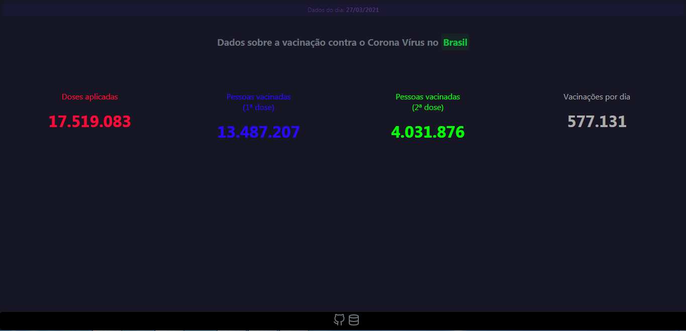

## Aplicação em Vue.js com dados sobre a vacinação do Covid-19 no Brasil :computer: 💉

### Como rodar o projeto :runner:
1. - **Instale as dependências 📦, pra basta dar um ```npm i``` 👍**
2. - **Rode o projeto com o comando ``` npm run serve ``` e voilà :ok_hand:**
### Tarefas 📑
- [x] Criar a aplicação com Vue-CLI :heavy_check_mark:
- [x] Consumir o Json com axios :heavy_check_mark:
- [x] Criar os componentes :heavy_check_mark:
- [x] Criar Grid responsivo :heavy_check_mark:
